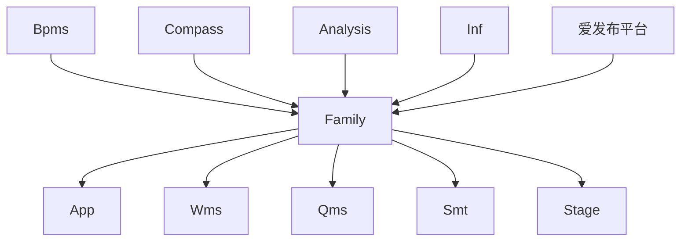
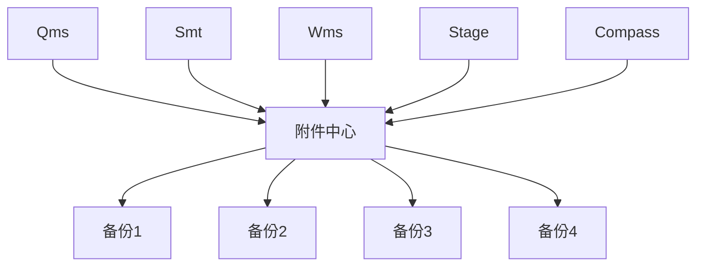

# 升职论文

### ——— 关于个人工作的总结与展望

<div class="font-serif text-base right-20 bottom-10 absolute">
  <span>发表人：蒋煜楷</span>
  <p>作成日：2023年3月19日</p>
</div>

---

# 目录

1. 前言
2. 对过往的总结
3. 对未来的展望
4. 结语

---
layout: two-cols
---

<template v-slot:default>

# 一、前言

《软件项目管理学》的里程碑(Milestone)，是项目中完成阶段性工作的标志，是一个任务结束的明确的起止点。

标志着上一个阶段的结束、下一个阶段开始。
</template>

<template v-slot:right>


</template>

<!--
1、如软件项目管理学中里程碑(Milestone)意义一般，是项目中完成阶段性工作的标志，是一个任务结束的明确的起止点。

2、通过基于项目现状的现实需求对未来的工作进行合理的展望，设定合理的个人工作预期，依照早期规划明确正确的努力及进步方向，从而更高效驱动自身发展与提高。
-->

---

# 二、对过往的总结

### 2.1、松元项目总结

- RPA
- 接口与Analysis表单

<!--
分为两个点来说

1、RPA

2、接口与Analysis表单
-->

---
layout: two-cols
---

<template v-slot:default>

# 2.1、RPA
RPA 是什么？

<p class="p-r-5">机器人流程自动化（Robotic process automation）简称RPA，是以软件机器人及人工智能（AI）为基础的业务流程自动化技术。</P>


<p class="p-r-5">在传统的工作流自动化技术工具中，会由程序设计师产生自动化任务的动作列表，并且会用内部的应用程序接口（API）或是专用的脚本语言作为和后台系统之间的接口。有些软件可能没有这类用途的API，而RPA可以降低其自动化的门槛。相较之下，RPA系统会观察使用者在应用软件中图形用户界面（GUI）所进行的工作，并且直接在GUI上自动重复这些工作。</p>

</template>
<template v-slot:right>


</template>

<!--RPA工具在技术上类似图形用户界面测试工具，这些测试工具也会自动和图形用户界面互动，并且通常是先由使用者示范其流程，再由这些工具来重现。和这类测试工具不同的地方在于，RPA工具可以在多个应用程序之间处理、交换数据，例如接收内含发票的电子邮件、取得其中数据，然后输入到簿记系统中。-->

---
layout: two-cols
---

<template v-slot:default>

# 2.1、RPA
为什么选择RPA

<p class="p-r-5">刚进公司的时候，跟进的第一块业务是松元工厂的RPA模块，用了一两周的时间，从零开始到接手松元RPA项目的维护和改进。起初，RPA的技术选择是因为松元公司对接的U8供应商无法提供相关接口。</p>

<p class="p-r-5">RPA主要是使用UIPATH这款软件进行实现类似脚本的可视化编程操作。和代码编程类似，得益于UIPATH给予的Windows统一的控制API，我们可以做到但不限于：数据库操作、本地配置文件读取、模拟点击、Windows进程管理、桌面快照等功能。通过可视化界面的任务动作编排，可以将原本需要员工手动录入系统的动作流程转换为RPA能理解的可执行程序。</p>

</template>
<template v-slot:right>


</template>

---

# 2.1、RPA

| | |
|---|---|
|✅好处1|代替人工频繁输入|
|✅好处2|可以进行全天候、半监督工作|
|✅好处3|可以进行数据库交互，实现系统之间的互通|

<br/>
<br/>

<!--
可视化的
-->
---

# 2.1、RPA

| | |
|---|---|
|❌用友系统升级|U8系统半夜升级或者是U8系统画面布局发生变化，UIPATH无法识别变动后的画面布局，导致RPA执行失败|
|❌Windows升级|UIPATH软件等不能正常启动，或Windows系统升级后bug等|
|❌用友账套限制|PA执行时相当于长期占用一个账套运行，导致RPA无法在白天执行，可能出现账套的抢占，影响其他用户正常工作|
|❌操作速度有上限|无法满足工厂日益增长的业务订单量，可能需要多台电脑的分批量的操作|
|❌遇到问题难以调试与复现|只能通过日志、录屏、邮件通知、脚本重跑的方式去调查问题|

问题还有很多...😵

---
layout: two-cols
---

<template v-slot:default>

# 2.1、RPA
RPA不止于RPA

周边知识点
- Windows的batch脚本编写
- Windows的定时任务
- pgcron的定时任务
- pgsql的存储过程
- Linux的crontab定时任务
- Linux的shell脚本编写
</template>

<template v-slot:right>

```batch
# 查看当前系统的所有进程
tasklist|find /i "%rpa%"
# 连接数据库
set PGPASSWORD=%password%
# for循环读取数据库结果
for /f "delims="  %%t in (
  'psql.exe -h %host% 
            -p %port%  
            -d %database% 
            -U %username% 
            -c "copy (%queueIcOutSql%) to STDOUT" '
  ) do (
    set result=%%t
)
```

</template>

---
layout: two-cols
---

# 2.1、接口与Analysis表单

## 接口

<ul class="p-r-5">
  <li>参与了松原的后台物料、Bom接口的开发，以及部分业务逻辑的改定；</li>
  <li>从stage的escort结合springboot的开发模式开始，陆续地修改了stage的多个画面和模块bug；</li>
</ul>

## Analysis表单

- 参与开发了松元最初的表单应用；
- 初步接触了analysis中的分析报表。

::right::

```shell
# execute api
execute_api=$(
curl -s -X POST "${stage_url}/oauth2/api/${api_address}" \
        -H "Authorization: bearer ${access_token}" \
        -H "Content-Type: application/json" \
        -d "${request_body}"
)

echo "Execute api: (inventoryListAdd)松元物料信息, request body: ${request_body}, current time: ${cur_time}" >> /home/a1stage/shell/mst/mstApiExecuteLog.txt
echo $execute_api >> /home/a1stage/shell/mst/mstApiExecuteLog.txt
```


---

# 2.2、巩城项目总结

- 服务器构筑
- 项目初期代码构筑

---

# 三、对未来的展望

## 项目上
- 技术平台
- 代码质量

## 组织上
- Stage Docs 文档管理
- Gitlab Issues

---
layout: two-cols
---

# 3.1 项目上——现状分析
stage的周边系统以及app的开发。

Stage的周边系统包括有:
- Bpms（审批流）
- Compass（报表制作平台）
- Analysis（数据分析看板、调度平台）
- Inf接口模块
- 爱发布平台
- 基于Cordova的移动端App（看板、pad、pda）
- Family（门户）

<br/>

### 那么，现阶段我们缺的是什么？

::right::

<br/>
<br/>
<br/>
<br/>



<!--
- Bpms、Analysis都是IC进行提供的平台，目前继续进行使用是没有问题的。
- 那么，现有的弊端是什么，我们要怎么进行解决？
-->

---

# 3.1 项目上——app的需求

## 1、App监控 

爱发布平台解决了app的在线升级与管理的需求，但是无法监控app在各个设备上的运行情况。

个人认为可以从人为手动发送日志到app自动发送日志的方向进行切入，但是目前基于Cordova框架的开发，还需要公司移动端开发人员的技术支持

<!--
- 目前我们的app开发，很大程度上依赖于黑盒测试；
- 用户提出的卡顿、闪退等问题我们都无法解决与复现，很大程度上限制了我们的开发，系统的使用上也一直被诟病；
- 
-->

---

# 3.1 项目上——全平台的监控

## 2、全平台的监控

可以用来监控各个ap以及服务器的工作状况，减少运维人员的工作量。可集成定时任务、邮件提醒、日志查看等功能，尽量的做到减少登录服务器后台的操作。

- 服务器运行状况
- 各个ap的服务器日志在线查看
- db的运行状况在线查看
<!--
也可以说是面向运维开发，同时也是有利于开发人员调查问题。
-->

---

# 3.1 项目上——全平台的监控

## 3、全平台的附件中心

可以通过minio开源平台进行部署一个静态资源的附件中心。将附件中心放在一台独立的服务器上，可实现多机器共享统一的附件中心，进而更方便的管理资源文件以及备份容灾操作。



所有系统都有权限直接读取附件中心的数据，有相关数据的dbid即可。

<!--
也可以说是面向运维开发，同时也是有利于开发人员调查问题。
-->

---
layout: iframe-right

# the web page source
url: http://10.191.5.124:9182/stage/
---

# 3.1 stage-doc

<!--
  关于stage的技术文档管理方面
-->

---
layout: iframe-right

# the web page source
url: http://10.191.5.124:9000
---

# 3.2 gitlab-issue
