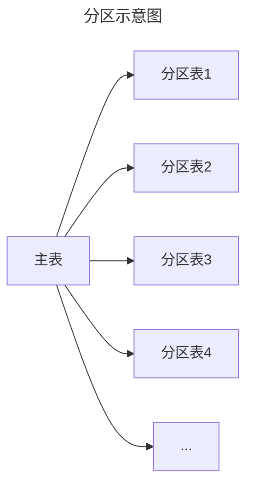

# 分区表分享

### ——— 关于分区表的创建与使用

<div class="font-serif text-base right-20 bottom-10 absolute">
  <span>发表人：蒋煜楷</span>
  <p>作成日：2023年6月14日</p>
</div>

---
layout: image-right

# the image source
image: https://source.unsplash.com/collection/94734566

# a custom class name to the content
class: my-cool-content-on-the-left
---

# 目录

1. 介绍分区表
2. 声明式分区表
    - RANGE 范围分区表
    - LIST 列表分区表
    - HASH 哈希分区表
3. 继承式分区表

---
layout: two-cols
---

<template v-slot:default>

# 一、介绍
什么是分区表？

**分区表：**

将逻辑上的一个大表分成一些物理上的小文件。 一个表何种情况下需要设计成分区表，取决于应用。

**使用分区表的时机：**

当表的尺寸超过了数据库服务器物理内存时，设计为分区表是有利的。

</template>

<template v-slot:right>

</template>

---

# 一、介绍
分区表的优点
<br>

**1、查询性能提升**

当那些访问频繁的数据在一个分区或者少数几个分区时，只需访问少数几个分区，不需要访问全表。

**2、更新性能提升**

当更新一个分区的大部分行时，可以通过该分区上的一个顺序扫描来取代分散到整个表上的索引和随机访问。

**3、节约成本**

很少使用的数据可以被迁移到便宜且较慢的存储介质上。

**4、批量插入删除数据性能提升**

可通过加载，删除分区表实现，可以避免批量 DELETE 导致的 VACUUM 开销。

> **VACUUM：** <br>
> postgresql中用于维护数据库磁盘空间的工具，最主要的工作是删除那些已经标识为删除的数据并释放空间。


---

# 二、声明式分区表
声明式分区表有三种类型：RANGE、LIST、HASH，mysql则多一种KEY分区

1. **RANGE 范围分区表**（多用于date或数值类型）

    基于一个给定区间边界，得到若干个连续区间范围，按照分区键的落点，把数据分配到不同的分区；
2. **LIST 列表分区表**（值没有规律）

    类似RANGE分区，区别在于LIST分区是基于枚举出的值列表分区，RANGE是基于给定连续区间范围分区；
3. **HASH哈希分区表**

    基于用户自定义的表达式的返回值，对其根据分区数来取模，从而进行记录在分区间的分配的模式。

    
4. **KEY**（MYSQL）

    类似于按HASH分区，区别在于KEY分区只支持计算一列或多列，且使用MySQL 服务器提供的自身的哈希函数。


---
layout: default
---
# 二、声明式分区表
## 创建主表
```sql
-- RANGE
create table range_table (
  id int not null,
  datetime date not null,
  name varchar(50)
) partition by range (datetime);

-- LIST
create table list_table (
  id int not null,
  datetime date not null,
  name varchar(50)
) partition by range (name);

-- HASH
create table hash_table (
  c1 int,
  c2 VARCHAR(10)
) partition by hash(c1);
```

---
layout: default
---
# 二、声明式分区表
## 创建分区表
```sql
-- RANGE
create table range_table202301_03 partition of range_table for values from ('2023-01-01') to ('2023-04-01');
create table range_table202304_06 partition of range_table for values from ('2023-04-01') to ('2023-07-01');
create table range_table202307_09 partition of range_table for values from ('2023-07-01') to ('2023-10-01');
create table range_table202310_12 partition of range_table for values from ('2023-10-01') to ('2024-01-01');
-- LIST
create table list_table_2022 partition of list_table for values in ('2022');
create table list_table_2023 partition of list_table for values in ('2023');
-- HASH
CREATE TABLE hash_table_0 PARTITION OF hash_table FOR VALUES WITH (MODULUS 4, REMAINDER 0);
CREATE TABLE hash_table_1 PARTITION OF hash_table FOR VALUES WITH (MODULUS 4, REMAINDER 1);
CREATE TABLE hash_table_2 PARTITION OF hash_table FOR VALUES WITH (MODULUS 4, REMAINDER 2);
CREATE TABLE hash_table_3 PARTITION OF hash_table FOR VALUES WITH (MODULUS 4, REMAINDER 3);

```

需要注意的是：<br>
HASH分区中，使用 FOR VALUES WITH 子句指定分区的计算方法，其中
- MODULUS 子句用于指定除数；
- REMAINDER 子句用于指定哈希值被除后的余数；

---

# 二、声明式分区表
## 判断当前pgsql配置是否支持分区表

```sql

--确保 enable_partition_pruning 开启,若不是 on,需要开启。
show enable_partition_pruning;

alter system set enable_partition_pruning = 'on';
select pg_reload_conf();

```

---

# 二、声明式分区表
## 查看表的所有分区

```sql
select
  c.relname
from
  pg_class c
  join pg_inherits i on i.inhrelid = c. oid
  join pg_class d on d.oid = i.inhparent
where
  d.relname = 'parent_table_name';
```

---

# 二、声明式分区表
## 给分区字段创建索引

```sql
-- RANGE
create index on range_table (datetime);
-- LIST
create index on list_table (name);
-- HASH
create index on hash_table (c1);
```

---

# 二、声明式分区表
## 创建数据

```sql
-- RANGE
insert into range_table 
select generate_series(1,10000) as key,(date '2023-01-01') + floor((random() * 90))::int,repeat( chr(int4(random()*26)+65),4)

-- LIST
insert into list_table 
select generate_series(1,10000) as key,(date '2022-01-01') + floor((random() * 365))::int,'2022'
insert into list_table 
select generate_series(1,10000) as key,(date '2023-01-01') + floor((random() * 365))::int,'2023'

-- HASH
INTO hash_table SELECT val,'val:'||val FROM generate_series(1,100000) val;
```

查看hash表数据的分布。
```sql
select count(*) from hash_table_0 ht;
select count(*) from hash_table_1 ht; 
select count(*) from hash_table_2 ht; 
select count(*) from hash_table_3 ht;
```

---

# 二、声明式分区表
## 验证分区表性能

```sql
-- RANGE
explain(ANALYZE,VERBOSE,BUFFERS) 
select * from range_table 
where datetime >= '2023-04-01' 
and datetime < '2023-07-01';
```

---

# 二、声明式分区表
## 挂载外部表

如果已经存在一张表为range 202210_12的表，结构与range_table相同则可以直接挂载到主表range_table。

```sql
alter table range_table attach 
partition range_table202210_12 
for values from ('2022-10-01') to ('2023-01-01');
```

---

# 二、声明式分区表
## 删除分区

可以节省空间，可以将不常用分区移动到其他性能比较低的硬盘上。

```sql
-- 移动分区成外部实体表，解除关联
alter table range_table detach 
partition range_table202301_03;    --首选
-- 删除分区以及数据
drop table range_table202301_03;
```

---

# 二、声明式分区表
## 创建新分区

```sql
-- RANGE
create table range_table202301_03 
partition of range_table 
for values from ('2023-01-01') to ('2023-04-01');
-- LIST
create table list_table_2024
partition of list_table 
for values in ('2024');
-- HASH
create table hash_table_5 
partition of hash_table 
for values with(modulus 4, remainder 0);
```

---

# 二、声明式分区表

## 新增分区满足插入需求

<br>

1. 使用pg_cron定时创建分区
2. 使用pg_partman分区管理插件
3. 实时创建分区，在插入之前使用trigger进行判断


---

# 三、继承式分区表
以RANGE范围分区为例

## 1、创建主表

```sql
CREATE TABLE almart
(
  date_key date,
  hour_key smallint,
  client_key integer,
  item_key integer,
  account integer,
  expense numeric
);
```

---

# 三、继承式分区表

## 2、创建分区表，继承于主表

```sql
CREATE TABLE almart_2015_12_10 () inherits (almart);
CREATE TABLE almart_2015_12_11 () inherits (almart);
CREATE TABLE almart_2015_12_12 () inherits (almart);
CREATE TABLE almart_2015_12_13 () inherits (almart);
```

---

# 三、继承式分区表

## 3、为分区表创建限制

```sql
ALTER TABLE almart_2015_12_10
ADD CONSTRAINT almart_2015_12_10_check_date_key
CHECK (date_Key = '2015-12-10'::date);
ALTER TABLE almart_2015_12_11
ADD CONSTRAINT almart_2015_12_10_check_date_key
CHECK (date_Key = '2015-12-11'::date);
ALTER TABLE almart_2015_12_12
ADD CONSTRAINT almart_2015_12_10_check_date_key
CHECK (date_Key = '2015-12-12'::date);
ALTER TABLE almart_2015_12_13
ADD CONSTRAINT almart_2015_12_10_check_date_key
CHECK (date_Key = '2015-12-13'::date);
```

---

# 三、继承式分区表

## 4、为分区表创建索引

```sql
CREATE INDEX almart_date_key_2015_12_10
ON almart_2015_12_10 (date_key);
CREATE INDEX almart_date_key_2015_12_11
ON almart_2015_12_11 (date_key);
CREATE INDEX almart_date_key_2015_12_12
ON almart_2015_12_12 (date_key);
CREATE INDEX almart_date_key_2015_12_13
ON almart_2015_12_13 (date_key);
```

---
layout: two-cols
---

# 三、继承式分区表

## 5、重定向操作
> 创建一个trigger将对主表的数据插入操作重定向到对应的分区表

### 创建trigger
```sql
--挂载分区Trigger
CREATE TRIGGER insert_almart_partition_trigger
BEFORE INSERT ON almart
FOR EACH ROW EXECUTE PROCEDURE almart_partition_trigger();
```

::right::

### 创建函数

```sql
--创建分区函数
CREATE OR REPLACE FUNCTION almart_partition_trigger()
RETURNS TRIGGER AS $$
BEGIN
    IF NEW.date_key = DATE '2015-12-10'
    THEN
        INSERT INTO almart_2015_12_10 VALUES (NEW.*);
    ELSIF NEW.date_key = DATE '2015-12-11'
    THEN
        INSERT INTO almart_2015_12_11 VALUES (NEW.*);
    ELSIF NEW.date_key = DATE '2015-12-12'
    THEN
        INSERT INTO almart_2015_12_12 VALUES (NEW.*);
    ELSIF NEW.date_key = DATE '2015-12-13'
    THEN
        INSERT INTO almart_2015_12_13 VALUES (NEW.*);
    ELSIF NEW.date_key = DATE '2015-12-14'
    THEN
        INSERT INTO almart_2015_12_14 VALUES (NEW.*);
    END IF;
    RETURN NULL;
END;
$$
LANGUAGE plpgsql;
```

---

# 三、继承式分区表

## 6、postgresql.conf

确保postgresql.conf中的constraint_exclusion配置项没有被disable


---
layout: end
---