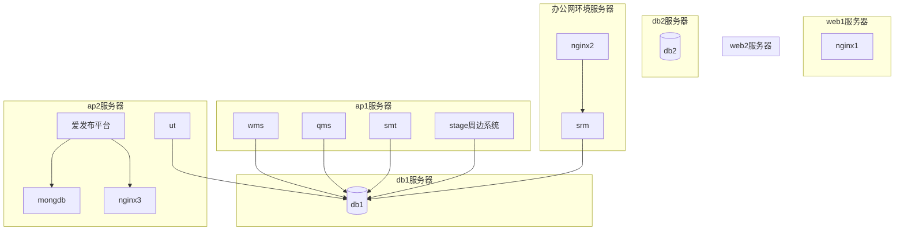
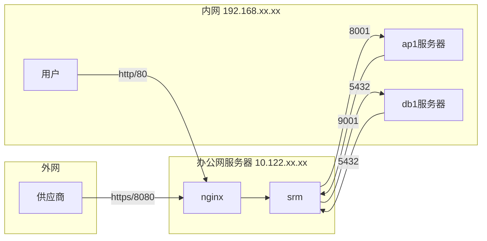
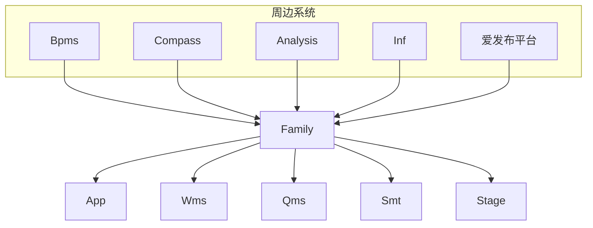
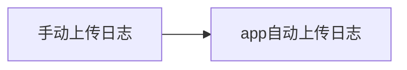
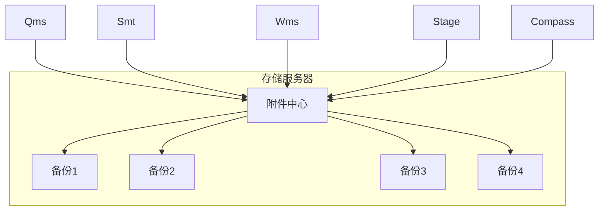
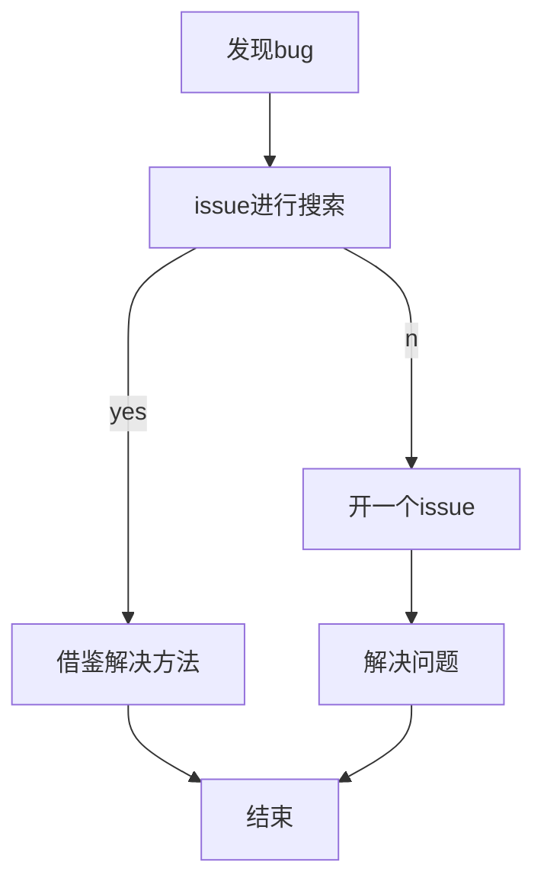

# 升职论文

### ——— 关于个人工作的总结与展望

<div class="font-serif text-base right-20 bottom-10 absolute">
  <span>发表人：蒋煜楷</span>
  <p>作成日：2023年3月19日</p>
</div>

---
layout: image-right

# the image source
image: https://source.unsplash.com/collection/94734566

# a custom class name to the content
class: my-cool-content-on-the-left
---

# 目录

1. 前言
2. 对过往的总结
3. 对未来的展望
4. 结语

---
layout: two-cols
---

<template v-slot:default>

# 一、前言

《软件项目管理学》的里程碑(Milestone)，是项目中完成阶段性工作的标志，是一个任务结束的明确的起止点。

标志着上一个阶段的结束、下一个阶段开始。

- 2021.7-2022.4 进入公司，当月加入松元项目的开发
- 2022.2-至今   加入巩城项目，主要负责QMS项目
</template>

<template v-slot:right>


</template>

<!--
1、如软件项目管理学中里程碑(Milestone)意义一般，是项目中完成阶段性工作的标志，是一个任务结束的明确的起止点。

2、通过基于项目现状的现实需求对未来的工作进行合理的展望，设定合理的个人工作预期，依照早期规划明确正确的努力及进步方向，从而更高效驱动自身发展与提高。
-->

---
layout: image-right

# the image source
image: https://source.unsplash.com/collection/94734566

# a custom class name to the content
class: my-cool-content-on-the-left
---

# 二、对过往的总结

### 2.1、松元项目总结

- RPA
- 接口与Analysis表单

<!--
分为两个点来说

1、RPA

2、接口与Analysis表单
-->

---
layout: two-cols
---

# 2.1、RPA
RPA 是什么？

- 机器人流程自动化（Robotic process automation）简称RPA，是以软件机器人及人工智能（AI）为基础的业务流程自动化技术。

- 在传统的工作流自动化技术工具中，会由程序设计师产生自动化任务的动作列表，并且会用内部的应用程序接口（API）或是专用的脚本语言作为和后台系统之间的接口。有些软件可能没有这类用途的API，而RPA可以降低其自动化的门槛。相较之下，RPA系统会观察使用者在应用软件中图形用户界面（GUI）所进行的工作，并且直接在GUI上自动重复这些工作。

<h2 v-click>
用人话说：
</h2>
<h2 v-click>
使用GUI图形界面进行拖拽编程
</h2>

::right::


<!--RPA工具在技术上类似图形用户界面测试工具，这些测试工具也会自动和图形用户界面互动，并且通常是先由使用者示范其流程，再由这些工具来重现。和这类测试工具不同的地方在于，RPA工具可以在多个应用程序之间处理、交换数据，例如接收内含发票的电子邮件、取得其中数据，然后输入到簿记系统中。-->

---
layout: two-cols
---

<template v-slot:default>

# 2.1、RPA
为什么选择RPA

- 刚进公司的时候，跟进的第一块业务是松元工厂的RPA模块，用了一两周的时间，从零开始到接手松元RPA项目的维护和改进。
- 起因是，RPA的技术选择是因为松元公司对接的U8供应商无法提供相关接口。


</template>
<template v-slot:right>


</template>

---

# 2.1、RPA

| | |
|---|---|
|✅好处1|代替人工频繁输入|
|✅好处2|可以进行全天候、半监督工作|
|✅好处3|可以进行数据库交互，实现系统之间的互通|

<br/>
<br/>

<!--
可视化的
-->
---

# 2.1、RPA

| | |
|---|---|
|❌用友系统升级|U8系统半夜升级或者是U8系统画面布局发生变化，UIPATH无法识别变动后的画面布局，导致RPA执行失败|
|❌Windows升级|UIPATH软件等不能正常启动，或Windows系统升级后bug等|
|❌用友账套限制|PA执行时相当于长期占用一个账套运行，导致RPA无法在白天执行，可能出现账套的抢占，影响其他用户正常工作|
|❌操作速度有上限|无法满足工厂日益增长的业务订单量，可能需要多台电脑的分批量的操作|
|❌遇到问题难以调试与复现|只能通过日志、录屏、邮件通知、脚本重跑的方式去调查问题|

问题还有很多...😵

---
layout: two-cols
---

<template v-slot:default>

# 2.1、RPA
RPA不止于RPA

周边知识点
- Windows的batch脚本编写
- Windows的定时任务
- pgcron的定时任务
- pgsql的存储过程
- Linux的crontab定时任务
- Linux的shell脚本编写
</template>

<template v-slot:right>

### batch

```batch
# 查看当前系统的所有进程
tasklist|find /i "%rpa%"
# 连接数据库
set PGPASSWORD=%password%
# for循环读取数据库结果
for /f "delims="  %%t in (
  'psql.exe -h %host% 
            -p %port%  
            -d %database% 
            -U %username% 
            -c "copy (%queueIcOutSql%) to STDOUT" '
  ) do (
    set result=%%t
)
```

### shell

```shell
# get the access_token of the family
access_token=$(curl -s -X GET "${family_url}/authentication/getAccessTokenWithoutLogin?username=${user_name}&siteId=${site_id}&password=${password}" | jq '.access_token')

# remove first and last quote (") from a variable
access_token="${access_token%\"}"
access_token="${access_token#\"}"
```

</template>

---
layout: two-cols
---

# 2.1、接口与Analysis表单

## 1、接口

<ul class="p-r-5">
  <li>参与了松原的后台物料、Bom接口的开发，以及部分业务逻辑的改定；</li>
  <li>从stage的escort结合springboot的开发模式开始，陆续地修改了stage的多个画面和模块bug；</li>
</ul>

## 2、Analysis表单

- 参与开发了松元最初的表单应用；
- 初步接触了analysis中的分析报表。

::right::

#### 部分接口代码
```java
 // 取得U8的token
  RestFormModel restFormModel = new RestFormModel();
  restFormModel.setPAccId("996");
  JSONObject dataJson = commonRestService.getU8Token(restFormModel);
  // 查询条件
  String condition  = "dnverifytime >= " + "'" + fromDateTime + "'" + "and dnverifytime <= " + "'" + toDateTime + "'" + "and cwhcode in ('602') and crdcode in ('0103')";
  jsonInfo.put(CommonGeneralConstants.U8InterfaceField.CACCID, dataJson.get("cAcc_ID"));
  jsonInfo.put(CommonGeneralConstants.U8InterfaceField.CONN, dataJson.get("Conn"));
  jsonInfo.put(CommonGeneralConstants.U8InterfaceField.TOKEN, dataJson.get("Token"));
  jsonInfo.put("ccode", condition);
```

#### 分析报表


---
layout: image-right

# the image source
image: https://source.unsplash.com/collection/94734566

# a custom class name to the content
class: my-cool-content-on-the-left
---

# 2.2、巩城项目总结

- 服务器构筑
- 项目初期代码构筑

---
layout: two-cols
---

# 2.2、服务器构筑

在巩城项目，出现了几个比较突出的问题：


### 一、巩城不提供外网访问
仅在服务器搭建初期开放外网进行操作。因此必须确认好本地服务器环境需要哪些依赖，并且都安装完毕。这块我们项目并未整理完备，因此后续因为依赖的问题使用了rpm等不同的方式进行补救安装，但遇到问题后处理过程相对繁杂。

::right::

公网环境
```shell
# 全局安装
yum install nginx
# 安装jq
yum install -y jq
# 安装zip压缩工具
yum install -y unzip zip
```
内网环境

> rpm的安装方式相对简单,但是需要对应版本
```shell
# 下载相关rpm包
# 可以看到安装的过程
rpm -ivh xxx.rpm
# 安装
rpm -i xxx.rpm
```

<!--
开始负责整体的服务器环境的搭建与维护，包括厦门测试环境搭建维护、本番UT环境搭建维护。
-->

---
layout: iframe-right
url: http://10.191.5.124:9182/docs/gcdn_docs/%E6%9C%8D%E5%8A%A1%E5%99%A8%E9%87%8D%E5%90%AF%E6%89%8B%E5%86%8C.html#_5%E3%80%81%E7%88%B1%E5%8F%91%E5%B8%83%E5%B9%B3%E5%8F%B0%E9%87%8D%E5%90%AF
---

# 2.2、服务器构筑

### 二、 需要构建内网的爱发布环境
爱发布项目的启动命令与开源项目的项目初始化命令不同，导致每次错执行了初始化命令导致docker无法启动;

**正确启动方式**
```bash
#!/bin/bash

docker-compose up -d
```

**错误启动方式**
```bash
#!/bin/bash

docker-compose up --build -d
```

<!--
输入docker-compose 搜索文档
-->

---

# 2.2、服务器构筑

### 三、服务器架构的冗余
本次客户提供的服务器架构可以做到双机备份容灾，但是因为我们项目并不支持，因此实际是UT和本番各自用一套服务器配置，数据库也没有实现双数据库热备份，抵抗风险的能力也比较差，这个问题在所有据点都有出现；



<!--
图中可以看到,巩城的服务器架构是这样的:
- 有两台的web服务器，用于搭建nginx，实际上只有一台在使用；
- wms等一系列的ap服务都是挂到同一个nginx上，设置相同的根路径
- ut环境的话，是用于用户环境中的测试使用，其实实际上用不太到
- db服务器按道理来讲实际的只有一台，每天晚上进行备份
-->

---

# 2.2、服务器构筑

### 四、巩城SRM需要外网访问

因此SRM在巩城的架构下，需要摘到一个外网办公网环境中，并且对外开通80、8080端口，在nginx中挂上https证书、强制http转https的操作等。仅只能与内网几个系统Ip地址互联，不能开通全Ip段的访问。巩城内网的网段是192.168开头，docker的启动默认起一个默认的虚拟网段192.168，因此导致无法访问到内部的系统以及数据库，进而导致无法启动SRM。



<!--
srm 
-->

---
layout: image-right

# the image source
image: https://source.unsplash.com/collection/94734566

# a custom class name to the content
class: my-cool-content-on-the-left
---

# 三、对未来的展望

## 项目上
- 技术平台
- 代码质量

## 组织上
- Stage Docs 文档管理
- Gitlab Issues

---
layout: two-cols
---

# 3.1 项目上——现状分析
stage的周边系统以及app的开发。

Stage的周边系统包括有:
- Bpms（审批流）
- Compass（报表制作平台）
- Analysis（数据分析看板、调度平台）
- Inf接口模块
- 爱发布平台
- 基于Cordova的移动端App（看板、pad、pda）
- Family（门户）

<br/>

<h3 v-click>
那么，现阶段我们缺的是什么？
</h3>

::right::

<br/>
<br/>
<br/>
<br/>



<!--
- Bpms、Analysis都是IC进行提供的平台，目前继续进行使用是没有问题的。
- 那么，现有的弊端是什么，我们要怎么进行解决？
-->

---
layout: two-cols
---

# 3.1 项目上——技术平台

## 1、App监控 

爱发布平台解决了app的在线升级与管理的需求，但是无法监控app在各个设备上的运行情况。

可以从人为手动发送日志到app自动发送日志的方向进行切入，但是目前基于Cordova框架的开发，还需要公司移动端开发人员的技术支持



::right::


<!--
- 目前我们的app开发，很大程度上依赖于黑盒测试；
- 用户提出的卡顿、闪退等问题我们都无法解决与复现，很大程度上限制了我们的开发，系统的使用上也一直被诟病；
-->

---
layout: two-cols
---

# 3.1 项目上——技术平台

## 2、全平台的监控

可以用来监控各个ap以及服务器的工作状况，减少运维人员的工作量。可集成定时任务、邮件提醒、日志查看等功能，尽量的做到减少登录服务器后台的操作。

- 服务器运行状况
- 各个ap的服务器日志在线查看
- db的运行状况在线查看

::right::
服务器信息监控

定时任务实现

<!--
也可以说是面向运维开发，同时也是有利于开发人员调查问题。
-->

---

# 3.1 项目上——全平台的监控

## 3、全平台的附件中心

可以通过minio开源平台进行部署一个静态资源的附件中心。将附件中心放在一台独立的服务器上，可实现多机器共享统一的附件中心，进而更方便的管理资源文件以及备份容灾操作。[官网文档]()



所有系统都有权限直接读取附件中心的数据，有相关数据的dbid即可。[内网参考地址](http://10.191.5.124:9001/login)

<!--
也可以说是面向运维开发，同时也是有利于开发人员调查问题。
-->

---
layout: iframe-right

# the web page source
url: http://10.191.5.124:9182/stage/stage_docs/
---

# 3.1 stage-doc

在qms项目搭建的初期，看过收集了很多以往项目的各式文档，看到了很多很有用的但是并没有被利用起来的内容

- app开发中的native-api的使用文档（例如如何打开收起安卓的keyboard等等）
- 前后端的开发规范
- 审批流的开发文档

<br/>

> “有谁做过关于xxx的项目开发？你可以去找xxx问一下等等”

<!--
  关于stage的技术文档管理方面

  我也经常会说出这种话来
-->

---
layout: two-cols
---

# 3.2 gitlab-issue


::right::

github上面的一个很好的习惯是如果遇到问题，就在项目的issue上进行搜索，没有类似的解决方案的时候再进行issue的新增提问开发者进行解决，这个是一个类似论坛的功能，也是一个非常好的管理方案。
- 1、发现并提出问题。
- 2、快速搜索解决方案。


---

# 3.3 文档管理的好处

1. 🔨**文档有履历**<br/>
可以很容易地对过去的问题进行调查、追溯、修改。老项目有旧的文档可以参考，新的项目则可以根据新的问题进行解决，不用担心和进行任何的对比操作；
2. 🦾**开发有依据**<br/>
统一的共通代码示例、用法介绍等等手册都可以放到该平台上，不用去项目内全局搜索，在缺少注释的情况下，也能很好的理解并复用代码；
3. ⛷**使用有痕迹**<br/>
不需要再提问谁做过什么项目，用过什么工具，写过什么代码，只需要根据当前文档的git提交记录即可找到对应修改过的开发者。并且可以让开发者不断的对该文档进行完善，常用常新；
4. 👍**协同开发没冲突**<br/>
现有的文档管理基于excel进行的半离线管理，每个编写人员手中都有一份离线的文档，不停的需要解决冲突的问题，并且还有丢失的风险。因此用git管理文档就不会互相污染造成文档问题，但是存在一定的使用门槛。

---
layout: image-right

# the image source
image: https://source.unsplash.com/collection/94734566

# a custom class name to the content
class: my-cool-content-on-the-left
---

# 四、总结
> 个人总结

个人的进步和成就往往离不开组织的培养和支持，正是有了组内各个成员的互助与信任，我才能获得如此大的进步与如此自由的发展空间。希望未来的工作里能不辜负组织期待的同时继续发光发热，给项目带来更多更有质量的代码与文档。