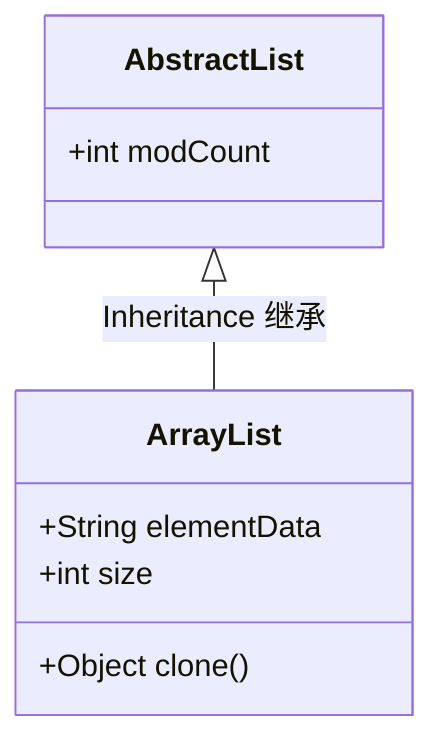

---
---
# List
> List是一个接口，没有具体的成员变量，因此实现类中可以针对不同的底层原理进行实现。
## 特性
1. 有序
2. 可重复
3. 有索引

## 实现类

### ArrayList

> jdk8之前，当实现类创建了对象，对象便会创建一个长度为10的数组；
> jdk8之后，当实现类创建了对象，对象便会创建一个长度为0的数组。

### LinkedList

### Vector
> Vector 在jdk2 后就被淘汰了，在此不作赘述。 