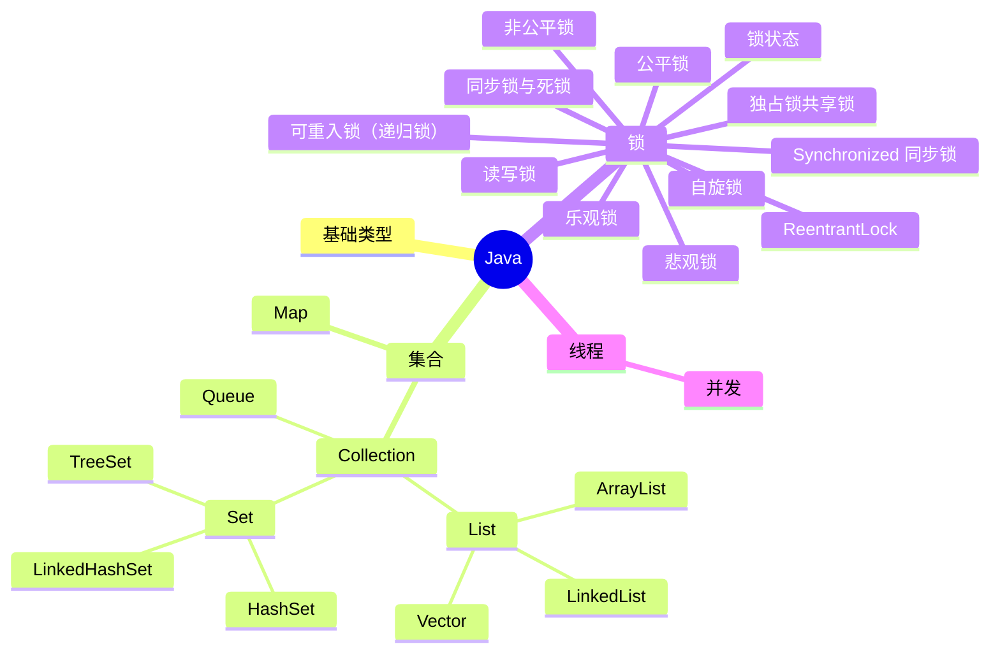

```mermaid
mindmap
  root((Java))
    基础类型
    集合
      Collection
        List
          ArrayList
          LinkedList
          Vector
        Set
          HashSet
          TreeSet
          LinkedHashSet
        Queue
      Map
    锁
      乐观锁
      悲观锁
      自旋锁
      Synchronized 同步锁
      ReentrantLock
      非公平锁
      公平锁
      可重入锁（递归锁）
      读写锁
      独占锁共享锁
      锁状态
      同步锁与死锁
    线程
      并发
```